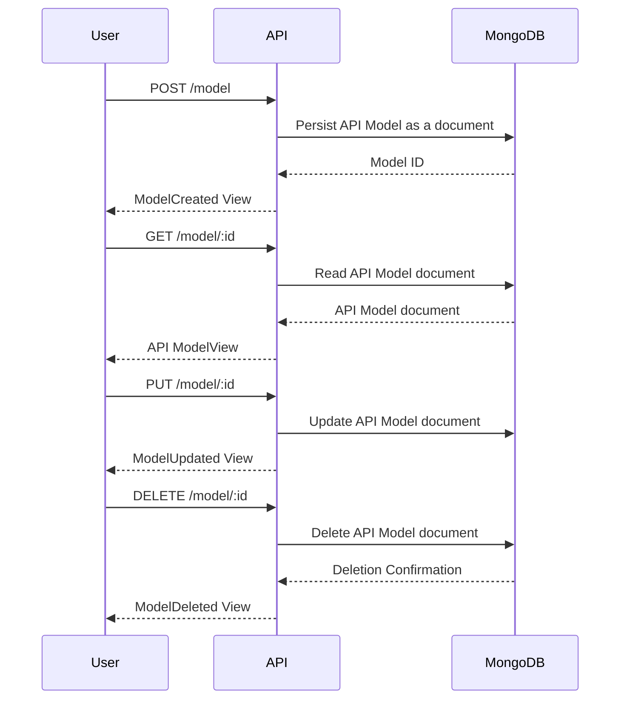
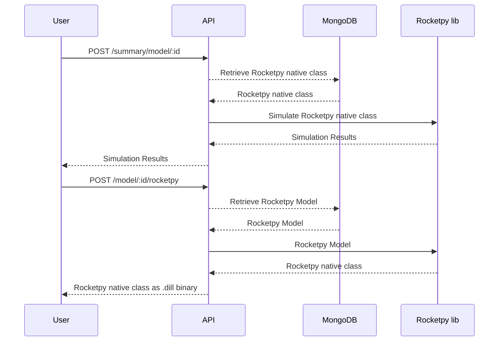

# Infinity-API

## Capabilities
- Performs rocket simulations and returns simulation data
- Stores simulation input data in mongo-db

## Setup
- [Install python3](https://www.python.org/downloads/) 3.11.5 or above
- [install mongodb-atlas](https://www.mongodb.com/try/download/community)
- Install dependencies `python3 -m pip install -r requirements.txt`

## Development
- make format
- make test
- make clean
- make build

## Starting the server
- Setup MONGODB_CONNECTION_STRING:
```
$ touch .env && echo MONGODB_CONNECTION_STRING="$ConnectionString" > .env
```

### Docker
- run docker compose: `docker-compose up --build -d`

### Standalone 
- Dev: `python3 -m uvicorn lib:app --reload --port 3000`
- Prod: `gunicorn -k uvicorn.workers.UvicornWorker lib:app -b 0.0.0.0:3000`

## Project structure
```
├── README.md    # this file
├── requirements.txt
│   
├── lib
│   │   
│   ├── api.py    # main app
│   │── secrets.py
│   │   
│   ├── controllers
│   │   ├── environment.py
│   │   ├── flight.py
│   │   ├── motor.py
│   │   └── rocket.py
│   │   
│   ├── services 
│   │   ├── environment.py
│   │   ├── flight.py
│   │   ├── motor.py
│   │   └── rocket.py
│   │   
│   ├── routes 
│   │   ├── environment.py
│   │   ├── flight.py
│   │   ├── motor.py
│   │   └── rocket.py
│   │   
│   ├── repositories
│   │   ├── repo.py
│   │   ├── environment.py
│   │   ├── flight.py
│   │   ├── motor.py
│   │   └── rocket.py
│   │   
│   ├── models
│   │   ├── aerosurfaces.py
│   │   ├── environment.py
│   │   ├── flight.py
│   │   ├── motor.py
│   │   └── rocket.py
│   │   
│   └── views
│       ├── environment.py
│       ├── flight.py
│       ├── motor.py
│       └── rocket.py
│   
└── tests
    ├── integration 
    │   ├── test_environment_integration.py
    │   ├── test_motor_integration.py
    │   ├── test_rocket_integration.py
    │   └── test_flight_integration.py
    │   
    └── unit
        ├── test_secrets.py
        ├── test_api.py
        │   
        ├── test_controllers
        │   ├── test_environment_controller.py
        │   ├── test_flight_controller.py
        │   ├── test_motor_controller.py
        │   └── test_rocket_controller.py
        │   
        ├── test_services
        │   ├── test_environment_service.py
        │   ├── test_flight_service.py
        │   ├── test_motor_service.py
        │   └── test_rocket_serice.py
        │
        ├── test_routes
        │   ├── test_environment_route.py
        │   ├── test_flight_route.py
        │   ├── test_motor_route.py
        │   └── test_rocket_route.py
        │
        ├── test_repositories
        │   ├── test_environment_repo.py
        │   ├── test_flight_repo.py
        │   ├── test_motor_repo.py
        │   └── test_rocket_repo.py
        │
        ├── test_models
        │   ├── test_environment_model.py
        │   ├── test_flight_model.py
        │   ├── test_motor_model.py
        │   └── test_rocket_model.py
        │   
        └── test_views
            ├── test_environment_view.py
            ├── test_flight_view.py
            ├── test_motor_view.py
            └── test_rocket_view.py
```

## DOCS
- OpenAPI standard: [https://api.rocketpy.org/redoc](https://api.rocketpy.org/redoc)
- Swagger UI: [https://api.rocketpy.org/docs](https://api.rocketpy.org/docs)

## API Flowchart
General API workflow. Current available models are: Environment, Flight, Rocket and Motor.

### CRUD


### Simulating and extracting RocketPY native classes

