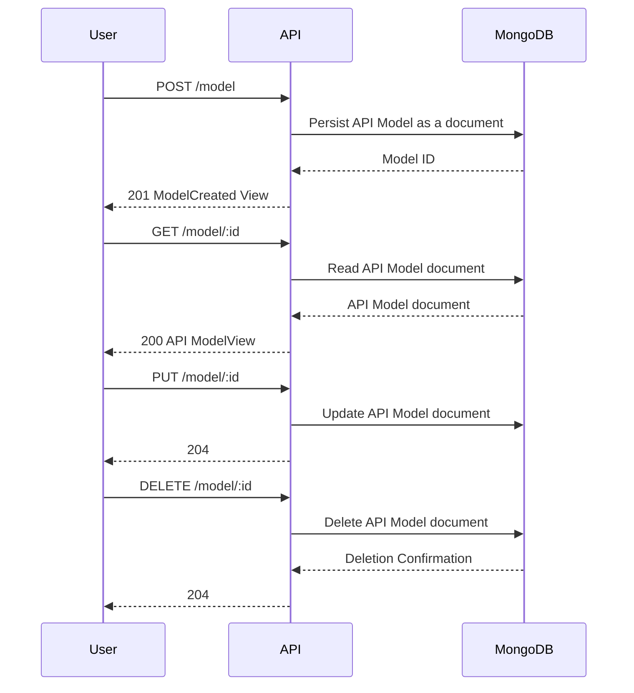
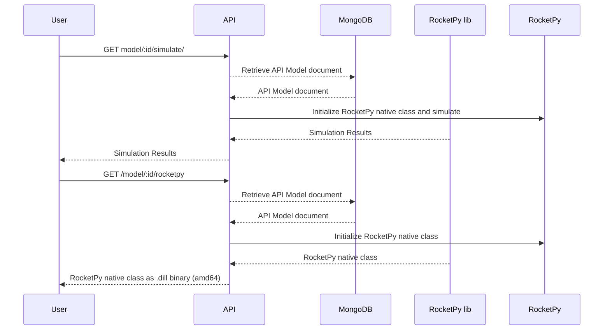

# Infinity-API

[](https://deepwiki.com/RocketPy-Team/Infinity-API)

## Capabilities
- Performs rocket simulations and returns simulation data
- Stores simulation input data in mongo-db

## Setup
- [Install python3](https://www.python.org/downloads/) 3.11.5 or above
- [install mongodb-atlas](https://www.mongodb.com/try/download/community)
- Install dependencies `python3 -m pip install -r requirements.txt`

## Development
- make format
- make test
- make clean
- make build

## Starting the server
- Setup MONGODB_CONNECTION_STRING:
```
$ touch .env && echo MONGODB_CONNECTION_STRING="$ConnectionString" > .env
```

### Docker
- run docker compose: `docker-compose up --build -d`

### Standalone 
- Dev: `python3 -m uvicorn src:app --reload --port 3000`
- Prod: `gunicorn -k uvicorn.workers.UvicornWorker src:app -b 0.0.0.0:3000`

## MCP Server
- The MCP bridge is mounted directly on the FastAPI app and is available at `/mcp` alongside the REST API.
- No extra process is required: `uvicorn src:app` serves both the REST routes and the MCP transport.

## Project structure
```
├── README.md    # this file
├── requirements.txt
│   
├── lib
│   │   
│   ├── api.py    # main app
│   │── secrets.py
│   │   
│   ├── controllers
│   │   ├── interface.py
│   │   ├── environment.py
│   │   ├── flight.py
│   │   ├── motor.py
│   │   └── rocket.py
│   │   
│   ├── services 
│   │   ├── environment.py
│   │   ├── flight.py
│   │   ├── motor.py
│   │   └── rocket.py
│   │   
│   ├── routes 
│   │   ├── environment.py
│   │   ├── flight.py
│   │   ├── motor.py
│   │   └── rocket.py
│   │   
│   ├── repositories
│   │   ├── interface.py
│   │   ├── environment.py
│   │   ├── flight.py
│   │   ├── motor.py
│   │   └── rocket.py
│   │   
│   ├── models
│   │   ├── interface.py
│   │   ├── environment.py
│   │   ├── flight.py
│   │   ├── motor.py
│   │   ├── rocket.py
│   │   │   
│   │   └── sub
│   │       ├── aerosurfaces.py
│   │       └── tanks.py
│   │   
│   └── views
│       ├── interface.py
│       ├── environment.py
│       ├── flight.py
│       ├── motor.py
│       └── rocket.py
│   
└── tests
```

## DOCS
- OpenAPI standard: [https://api.rocketpy.org/redoc](https://api.rocketpy.org/redoc)
- Swagger UI: [https://api.rocketpy.org/docs](https://api.rocketpy.org/docs)

## API Flowchart
General API workflow. Current available models are: Environment, Flight, Rocket and Motor.

### CRUD


### Simulating and extracting RocketPY native classes

